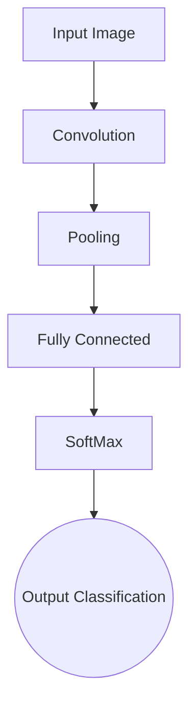

This name is given because Convolution, refers to the filtering process that happens in this type of network.

The computer sees an image as 0s and 1s (Binary Digits). 
	**Pixel** is the smallest unit in an image
		The pixel are labeled 0-255.

 There are two ways to process an image:
## Grey scale

	It's a range of grey shades from white to black. The number the computer assign to each pixel represent the level of darkness.

## RBG Values

	It's the combination of Red,Green and Blue. The computer extract the value from each pixel and puts the results in an array.


|Value|Red|Green|Blue|Black|White|
|--|--|--|--|--|--|
|R:|255|0|0|0|255|
|G:|0|255|0|0|255|
|B:|0|0|255|0|255|


## Image Representation

The images are represented as: Height x Width x # Channels
	# Channels -> 1 for greyscale image and 3 for RBG images

# Computer Vision (CV)

This is a field of AI that trains computers to interpreted and understand the visual world.
The deep learning model could be training with images and videos, and so this can identify and classify objects, reacting to what they "see".

# Digital Image

Standard digital image formats include

- 1 sample per point (B&W/Grayscale)
- 3 samples per point ( Red, Green, and Blue)
- 4 samples per point (Red, Green, Blue, and Alpha/opacity)

The image processing ends:

- Low-Level: Inputs and outputs are images. Ex: Noise removal, image Sharpening.
- Mid-Level: Outputs are the attributes extracted from input images. Ex: Object Recognition, Image Segmentation.
- High-Level: An ensemble of recognition of individual objects. Ex: Scene Understanding, Autonomous Navigation

# Disadvantages of MLP

- Need to connect neurons in the hidden layer to ALL the neurons in the input layer
- No spatially invariant -> Sensitive to the object's position
- No spatial information: When we reshape from 2D to 1D, it doesn't understard the spatial structure of the image. 
	- For example, if a picture of a cat appears in the top left of the image in one picture and the bottom right of another picture, the MLP will try to correct itself and assume that a cat will always appear in this section of the image.

![[Disadvantages of MLP.png]]

- MLPs use one perceptron for each input. Unmanageable for large images. 

# CNN

CNN are designed to be spatially invariant. They aren't sensitive to the object's position in the picture.  Also, this'll work well if the image have more features. Because this take advantage for the nearby pixels, which are more strongly related than distant ones. 

# Comparison of CNN and ANN/MLP

Regular Neural Networks:

- Transform an input by putting it through a series of hidden layers.
- Every layer is made up of a set of neurons, where each layer is fully connected to all neurons in the layer before.
- Finally, there is a last fully-connected layer — the output layer — that represents the predictions.

In CNNs :

- The layers are organized in 3 dimensions: width, height, and depth.
- The neurons in one layer do not connect to all the neurons in the next layer but only to a small region.

# CNN Working

## CNN Components

CNN's have two components:

- Hidden Layers / Feature extraction Part:
	The network'll perform a series of operations during where the features are detected. 
		Example: With the picture of a zebra, the network'd recognize its stripes, two eard, and four legs.

- Classification Part:
	This part assigns a probability of the object being in that image.

![[CNN's components.png]]

The basic architecture is: 



## What do CNN layers learn?

- Each CNN layer learns filters of increasing complexity.
- The first layers learn basic feature detection filters: edges, corners, etc
- The middle layers learn filters that detect parts of objects. For faces, they might learn to respond to eyes, noses, etc
- The last layers have higher representations: they learn to recognize full objects, in different shapes and positions.

The earlier features of a ConvNet contain more generic features (e.g., edge detectors or color blob detectors), but later layers of the ConvNet become progressively more specific to the details of the classes contained in the original dataset.

# Transfer Learning

Transfer learning uses the knowledge gained while solving one problem and applying it to a different but related problem.

	Example: Knowledge gained while learning recognize car can be used to some extent to recognize trucks.

## Pre-training

When we train a network on a large dataset(for example, ImageNet), we train all the neural network parameters, and therefore the model is learned. It may take hours on your GPU to train on such a large dataset. This model is known as a Pre-trained model.

## Fine Tuning

We can give the new dataset to fine-tune the pre-trained CNN. Consider that the new dataset is almost similar to the original dataset used for pre-training. Since the new dataset is similar, the same weights can be used to extract the new dataset's features.

1. If the new dataset is very small, it's better to train only the final layers of the network to avoid overfitting, keeping all other layers fixed. So, remove the pre-trained network's final layers and add new ones. Retrain only the new layers.
2. If the new dataset is large, retrain the whole network with initial weights from the pre-trained model.

Another major advantage of using transfer learning is how well the model generalizes.

Larger models tend to overfit the data and don't work well when testing it out on unseen data. Since transfer learning allows the model to see different types of data, it learns the underlying rules of the world better.

You can look at this video if you're interested in learning how Transfer Learning is performed. It's a slightly advanced topic, so don't worry if you don't get it in the first go. Also, the instructor is using Keras but the same code will work with tf.Keras as well.

# Data Augmentation

We need minor alterations to our existing dataset to get more data. The NN would think these are another images.
The property "Invariance" give to CNN the ability to classify objects even if this changes properties as translation, viewpoint, size, or illumination.
This is one of the methos for avoid overfitting in CNN. 

Some popular augmentation techniques on images are:
-  Flip - horizontally/vertically
-  Rotation
-  Scale
-  Crop
-  Translation
*  Varying Color
-  Adding noise
-  Adjusting brightness

The data augmentation is usually performed on "Train Set" and often "Validation Set". 

The function **ImageDataGenerator** helps in performing Data Augmentation techniques. But there are multiple options.
Example:
```python
train_datagen = ImageDataGenerator(  
								   rotation_range=20, 
								   width_shift_range=0.2, 
								   height_shift_range=0.2, 
								   shear_range=0.2, 
								   zoom_range=0.2, 
								   horizontal_flip=True, 
								   vertical_flip=True, 
								   fill_mode='nearest'
								   )
```

# CNN -Main Layer Components

- Convolution Layer
	-  Consists of several filters or kernels
	- Passed over the entire image in patches and computes a dot product
	- Result is summed up into one number per operation (dot product)
- Pooling Layer
	- reducing the number of parameters by downsamples feature maps from conv layers
	- Typically max-pooling is used which selects the max-pixel value out of a patch of pixels
	- Helps for faster training and prevent overfitting
	- Various types of pooling are available like sum, mean, max
- Activation Layer
	- Feature maps\pooled outputs are sent through non-linear activations
	- Introduces non-linearity and helps train via backpropagation.

[CNN Example Notebook](https://github.com/dipanjanS/convolutional_neural_networks_essentials/blob/master/tutorials/01_Convolutional_Neural_Network_Essentials_Layer_Ops.ipynb)
