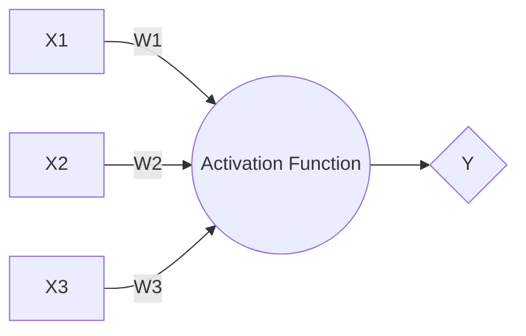
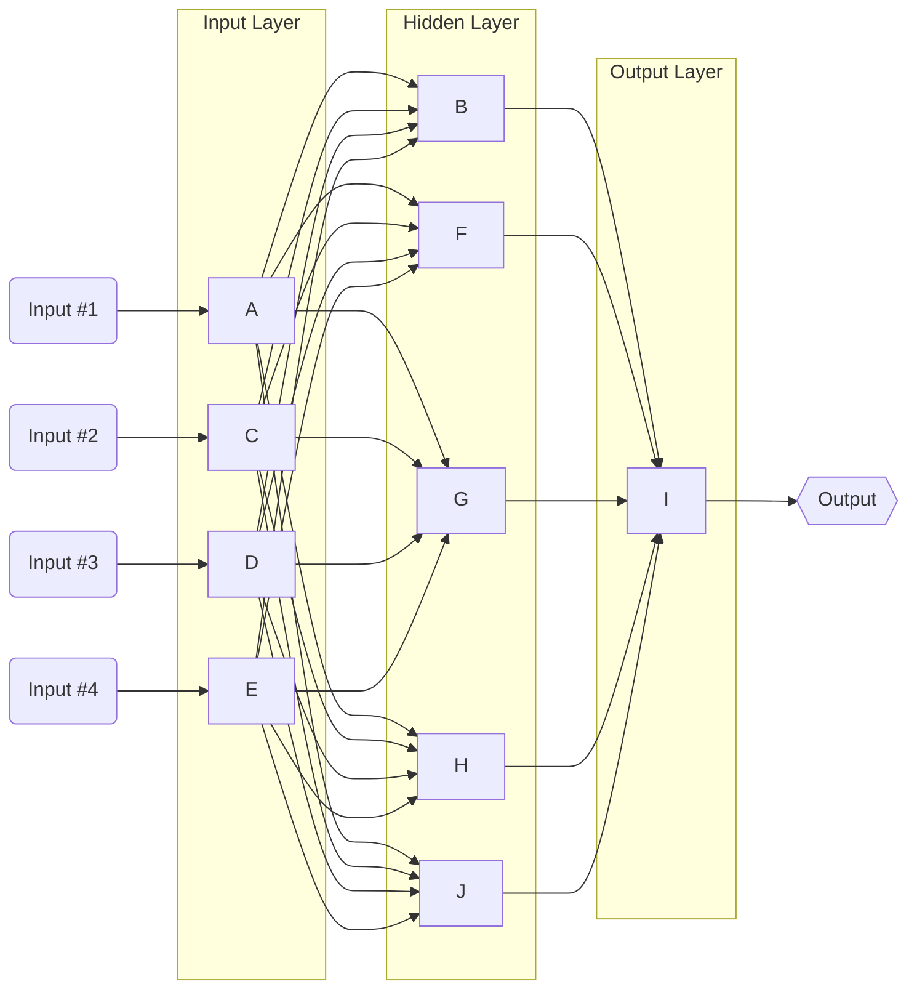

# Perceptron

It’s a kind of Artificial Neural Network. A single ANN is called perceptron is the most basic unit.

## Single Layer Percentron

Each input feature is given a weight to determine how important it is.

## Multiple Layer Perceptron (MLP)

When we join mutiple perceptrons, this is going to have several layers, to solve complex problems. For this example this have 3 layers.
## Neuronal:

Inside it’s so the pondered sum of the inlet data with the respective weight. It a lineal operation.

The functionality is similar a regression, this weight are values which are changing.

The term b allow to give movement or elasticity to our model.

### AND

Return 0 if some inlet is off, and return 1 if the inlet door are actives

### OR

If some inlet is active this return 1, it means, positive outlet

### XOR

Required 2 hyper planes for difference the outlet, it means, one neuronal can not find the solution

The Neural Red can be composed for different layers:

## Weights
There is some weight assigned for each connection. Weights respresent scalar multiplication. Initially, these are assigned randomly, then, these weights are updated as per their importance in predicting the output. The updation of weight is done through **Backpropagation**.

## Weight Initialization

This is a topic subject in Optimizer because, the weight is assign can help us to converged more fast, make for the Neural Network learn better the training data, and It's important because distribute the weight with a different "weight" help to learn differents features. That is one of the most common topics, because we need for every neuron learn a different topic/feature, in that way the neurons can learn better and expand the knowledge.

[Initialization explain](https://www.deeplearning.ai/ai-notes/initialization/index.html)
## 1- Input Layer:

It’s where the data is received.
The inputs are simply the measure of our features. If we have 13 input features, so the input layer will have 13 neurons.

## 2-Hidden Layer:

Processing the data and go out the features, also this is know as black box because here is where the features are identify in a small portions. There are 2 categories:

We initially assign the number of neurons in these hidden layers, and we can find the optimal number of neurons in the hidden layer through **hyperparameter tuning**.
### 2.1- General Characteristics

### 2.2- Specific Characteristics

While the data is passing the layers, the characteristics are took. So at the end, the data is more detailed

## 3- Outlet Layer:

That are the layers who do the predictions.

Every inlet *weight is known as point product , it’s the way for resolve the matriz with a vector*.

If there are more than 3 layers (Input, Hidden, Output) in a Neural Network, we call it a **Deep Neural Network**

# Activation Function

It’s a filter that allow or no to pass the data for this gives a response. This need to pass a umbral - exist 2 types:

-Discreet

-Continuous

The activation functions decide whether a neuoron should be activated (Fired) or not based on whether each neuron's input is relevant to the model's prediction.

The purpose of the activation function is to introdcue non-linearuty into the output of a neuron. It helps to creating a boundary.

The functions more used are:

## -Threshold Function/ Escalonada:

For values more or equal to 0 is 1, for values minus to 0 is 0. Good for binaries problems

## -Signo Function/Signum:

Similar to threshold function but this allow the negative values

## -Sigmoidal Function/Sigmoid:

Continuos values, it’s good in probability cases. Although this goes the 0-1.

Has disadvantages with small values or big values because this go to the extremes.

## -Tanh Function/Tangent Hyperbolic:

Similar to sigmoidal, but this model allow the negatives values because the range go since [-1,1]
$$
Tanh(x) = {1-e^{-2x} \over 1+e^{-2x}}
$$

## -RelU function/ Lineal Rectificada:

If the values is minus to 0, this is going to be always 0. Else, left the value which is coming. It means, this can be alargue to infinite but in a lineal way

$$
R(x)=max(0,x)
$$
$$
x<0 \space\space\space =>\space\space\space R(x)=0
$$
$$
x>=0 \space \space \space =>\space\space\space R(x)=x
$$
The problem this present is some gradients can be fragile during training and can die. It can cause a weight update which will makes it never activate an any data point again. Simply saying that RelU could result in Dead Neurons.
## -Softmax Function:

Return the probability of the possible outlet

# Loss function:

This told us if the predict data and the real data have a good relationship or if the model predict in a good way.

This is the way for know if the model has a good performance.

There are 2 good algorithm for this:

-Mean Squared Error(MSE)

-Cross Entropy (Measured the distance between Yp to Y)

**We are looking for the most low value**.

The error is calculated as the difference between the actual and predicted output. 
The function that is used to compute this error is known as the Loss Function.

For Binary Classification problems, the loss function usually used is known as Binary Cross Entropy Loss.

# Optimization Functions

The optimization functions are used to minimize or maximise the error functions.

There are different types of optimization functions:
- Gradient Descent
- Stochastic Gradient Descent
- Mini Batch Gradient Descent
- Ada grad
- Ada delta
- Adam
## Gradient Descent:

it's an optimization technique, This optimized weight through the derivative. It’s the principle for the optimization of the loss/cost function, by get the value most lower.

- Gradient means, the rate of inclination or declionation of a slope of a function at some point. (Steep and direction)
- Descent means, an act of moving downwards.

How this works? The GD iteratively adjusts the parameters and gradually finds the best values for them by minimizing the cost.

In summary, GD is a technique to minimize the loss/cost function. It helps in making the model perform better.

### -learning rate: 
It's the rate at wich we update the values of the parameters during GD.
This value is proportional with the weights.

it’s the distance of the step for this converge in the minimum, it means delta h

There are cases where we will find a local minimum or a global minimum. The momentum is the principle for this work and find the minimum global.

#### -Epochs

The Epoch is when an **ENTIRE** dataset is passed forward and backward through the neural network only **ONCE**.

Train a Neural Network takes more than a few wpochs. Once is not enough.

Note: There is no guarantee a network will converge or get better by letting it learn the data for multiple epochs. It is an art in ML to decide the number of epochs sufficient for a network.

#### -Batch

When we have a big dataset is hard for we pass all the dataset in the neural network at once. For that we divide dataset into **Number of Batches (Sets/Parts)** 

**Batch Size** = Total number of training examples present in a single batch.

**Example:**

**2000 -> Training Examples**
We can divide the dataset of 2000 samples into **batches of 500**
**Batch Size is 500**.
**Number of batches is 2000/500=4**

Thus, when all the **4 batches** pass through the model back and forth once. It'll complete **1 epoch**.

## Stochastic Gradient Descent (SGD)

Use one (Randomly picked) sample for a forward pass and then just adjust weights.

SGD on the other hand performs a parameter update for each training example. It is usually much faster technique. It performs one update at a time.
Now due to these frequent updates, parameters updates have high variance and causes the Loss Function to fluctuate to different intensities. This is actually a good thing because it helps us discover new and possibly better local minima, whereas Standard GD will only converge to the minimum of the basin as mentioned above.

The problem with SGD is that due to the frequent updates and fluctuations it ultimately complicates the convergence to the exact minimun and will keep overshooting due to the frequent fluctuations.

The graph of Loss vs Epoch is no so smooth because much more updates are happening here than in Batch GD.
## Mini Batch Gradient Descent

It's the mix between SGD and BGD

An improvement to avoid all the problems and demerits of SGD and GD would be to use Mini Batch GD as it takes the best of both tchniques and performs an update for every batch with n training examples in each batch.
If reduces the variance in the parameter updates, which can ultimately lead us to a much better and stable convergence. 
	- The sizes range is from 50 to 256, but can vary as per the application and problem being sovled.
	- Typically is the algorithm of choice when training a Neural Network nowadays.

The normal Batch GD use all training samples for one forward pass and then adjust weights. This is a bad practice, It's good for small training sets.

The mini BGD is similar to SGD, use a batch of randomly picked training samples.

## ADA Grad
ADAGrad modifies the general learning rate ata each time step for every parameter (Omega(i)), based on the past gradients that have been computed for parameter (Omega(i)).
The benefit is that we don't need to manually tune the learning rate. Most implementations use a default value of 0.01 and leave it at that.
## ADAM
ADAM works well in practice and compares favorably to other adaptative leaning-method algorithms as it converges very fast and the learning speed of the Model is quiet Fast and efficient and also it rectifies every problem that is faced in other optimization techniques such as vanishing Learning rate, slow convergence or high variance in the parameter uopdates which leads to fluctuating Loss Function.
# Propagation
There are two kind of propagation:

## Forward Propagation

The signal goes from input layers towards output layers. We need to feed input data to generate output or desired results.

## Back propagation:

The signal goes from output to input layers.

It’s the way for redistributed the error in the previous layers and update the weight. This is the way for reduced the error when the Neural Network do the prediction at the end.

To reduce these errors which are generate through forward propagation, we traverse back from the output layer to the input layer and update the initially assingned weights.

# Working of a Neural Network

There are three main steps which explain the way as the Neural Network Work, that are:
	1- Forward Propagation
	2- Gradient Descent
	3- Backward Propagation