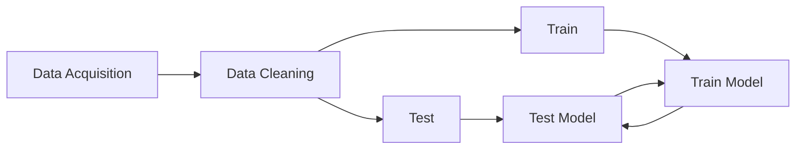

Machine learning can be known as a magical box that help us to predict whatever we want.

In Machine learning there are some differents terminology that can help for train, test, and create models for any pourpouse. This are known as Keywords in ML:

- Features or variables: All the data in the dataset are features.
- Target / Label Variable: It is the feature of a dataset about which you want to gain a deeper understanding.
- Predictor / Input variables: They are sometimes called Predictor Variables or Descriptors as well. This can be the features with the want we want to extract the information for train our models.
- Dependent and Independent Variables: The input variables are known as the independent variables, and the target variable is known as the dependent variable.

Variables = Features
Input Variables = Attributes = Predictors = Descriptors = Independent variables 
Target Variables = Labels = Outcomes = Dependent Variables

# Train and Test Sets

- After we clean the data, we split the data in Train and Test data
- The train data is used to build a model
- The test data is used to evaluate or test the model to check the performance.

# Train Test Split
- If we consider a Example where our Original Dataset has 1000 rows.
- When we build our ML model, we will split our dataset into two parts (70% train data and 30% test data).

# Types of Algorithms
## Supervised Learning Algorithms
* This kind of algorithms have a datasets with input variables and target variables.
* This is called supervised learning because the process of an algorithm learning from the training dataset can be thought of as a teacher supervising the learning process. **We know the correct answers**; the algorithm iteratively makes predictions on the training data and is corrected by the teacher. Learning stops when the algorithm achieves an acceptable level of performance.
### Types of SLA
 We can find two can of groups in which this kind of algorithm can be use.
	 - Classification
	 - Regression
## Unsupervised Learning Algorithms (ULA)
* This kind of algorithms have a datasets without target variables, just the input variables. This is known as unlabeled data.
* ULA aim to find some structure in the dataset. This is know with this name because there are no correct answers and there is no teacher, unlike supervised learning. Algorithms are left on their own to discover and present the interesting structure in the data.

# Cost Function
* Cost function is a measure of how wrong the model is in terms of its ability to estimate the relationship between X and Y.
* It's used to estimate how badly models are performing.
* The difference between the model's **predicted value** and the **true value** is called **RESIDUAL** or **COST** or **LOSS**. Which needs to be minimized.
## Cost Function Types
- Exist different kinds of algorithms for evaluate linear models.
	1- Mean Squared Error (MSE)
	2- Root Mean Squared Error (RMSE)
	3- Mean Absolute Error (MAE)

All of this are expalined in **Stadistics/Basic Stadistics**

