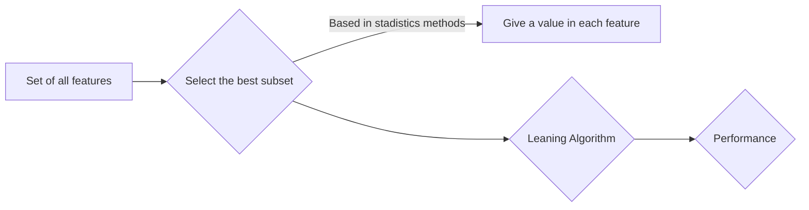
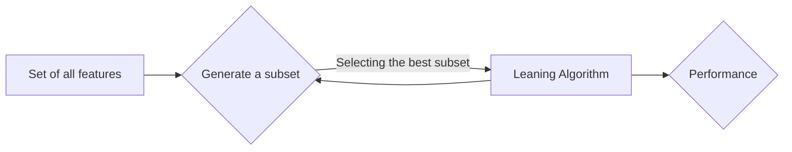
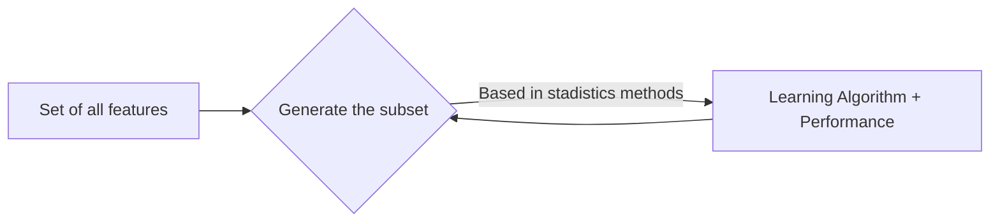

# Pearson Correlation
Measure the relation between 2 categories/variables
	There are 2 main params in this method:
	- Correlation coeficient
	- P-Value

## Correlation Coeficient
Measure the dispertion in the data
	Close +1 -> Large positive relationship
	Close 0 -> No relationship
	Close -1 -> Large negative relationship
The relationship is lineal if more near to +1 or -1
## P-Value

	P-value < 0.001 -> Strong certainly in the result
	p-value < 0.05 -> Moderate certainly in the result
	p-value < 0.1 -> Weak certainly in the result
	p-value > 0.1 -> No certainly in the result
		

# Anova (Analysis of Variance)
It's a stadistic method for testing if there are changes considerable between the mean amoung 2 or more groups

Anova return:
	- F-Score
	- P-Value

## F-Test-Score
Anova assume that the mean of all groups is the same. 
Calculate how many is the desviation between the real mean and current mean(Suppuest)

# Mean Square Error (MSE)
It's the mean of the square difference between the true value and the predict value for the regression model

Penalty the small error values that drive to over estimate the how many bad is the model

$$
 MSE = {1 \over n}\sum{(Y- \hat{Y})^2}
$$

Worst is the model if the value is high

# Root Mean Square Error (RMSE)

It's preferible in some case, because first, realized the square error and later, the mean. For that the mean do a high penalizations if the error is big. It's util when we don't have a big errors.

$$
 RMSE = \sqrt{{1 \over n} \sum{(Y- \hat{Y})^2 }} = \sqrt{MSE}
$$

# Mean Absolute Error (MAE)

Don't penality the values as same as MSE (Talking in effiency), but it's more roboust with atipic/outliers values. Don't penalty the atipic values as MSE, take more easy that can of value.

$$
 MAE = {1 \over n}{|Y- \hat{Y}|}
$$
# Coefficient of Determination (R^2)

Compare the values of a line with the real values, this based in a mean of each value.

If the value is negative that means the model is worst than predict the mean or the mean isn't the correct.

$$
 R^2 = 1 - {\sum{(Y- \hat{Y})^2} \over \sum{(Y- \bar{Y})^2}}
$$

# Bias

It's the difference between the prediction waited and the true value, how far the predicction to be of the true values

# Variance

Refer to the amount that the estimation will change if it's used difference train data. How many change the model deppent of the train data.

# Bias-Variance Trade Off

Search getting the down bias and down variance.

# Total Error

Comprended the biad and variance is fundamentaly for understand the behavior of the  predict models, however the general error is most importanted.

# Overfitting (High Variance)

When the model is fit to learn the specific cases (Train) and that can't recognized new data, that can happened because that take all the data, included the atipic values. By the way, this tries for contained all the data.

# Underfitting (High Bias)

When the data are too little that is no able to create a model.

# Metrics Classification Model

## Confusition Matrix

It's the table for describe the predictions

|               | Predict Yes | Predict No |  
|---------------|----------------|---------------|
| Actual Yes | TP             | FN            |
| Actual No  | FP             | TN            |   

	TP (True Positive) -> That is the case which predict true and the actual value is true, meaning the predict did in a right way (correct).
	TN (True Negative) -> The predict is False and the actual value is False. Meaning, the predict did in a right way.
	FP (False Positive) -> The predict is true but the actual value is false. Meaning, the predict was incorrect (Type I Error)
	FN (False Negative) -> The predict is false but the actual value is true. Meaning, the predict was incorrect (Type II Error)

## Accuracy

It's the relation between the number of correct predictions over the total number of predictions

$$
	AC = { 
\text{N° Correct Predicts} \over \text{Total N° of Predictions}}
$$
$$
	AC = { 
TP+TN \over TP+TN+FP+FN}
$$
This'll have a bad result if there are **imbalanced classes**

## Precision

Correct predictions positive from the total of positive predictions

$$
Precision = {TP \over TP+FP}
$$
## Sensitivity/Recall

Correct predictions positive from the total number of positives

$$
Recall = {TP \over TP+FN}
$$

## F1-Score

If we wish to know the algorithm is better, we need to check differents umbral for have the params.

$$
F1= {2 *\text{Precision}*\text{Recall} \over \text{Precision}+\text{Recall}}
$$
This is the best metric for know if the data has a imablanced classes, penalty **FN** and **FP**

## Receiver Operator Characteristic Curve (ROC Curve)

It's a graph method when we have a binary classification, meaning, 2 outlets possibles. This is based  in the prababilistic model. It's practiced because show all the umbral values

Params: 
- True Positive Rate (TPR) -> Recall
- False Positive Rate (FPR) -> $$ FPR = \frac{FP}{FP+TN} $$
- TPR vs FPR

## Area Under the ROC Curve (AUC)

Measured of the bidimentional complete area over of all the ROC curve, this metic is well when there are imabalanced classes

## Threshold

Its comun will use when we have probabilistic predictions, this return values since 0 to 1, in general always is 0.5. This value can be modfied for do more/less tolerance

## Log Loss 

As AUC-ROC take the orden of the predict probabilistics and that don't take into account the capacity of the model for predict high probabilities. In that case, we use the **Log Loss**

$$
-\frac{1}{N} \sum{y_i * log(p_i)+(1-y_i)*log(1-p_i)}
$$
$$
Where: p_i = P(y_i)
$$
# Cross Validation 

It's practiced and useful when we wish to know the model performance but with data the model don't know or we don't use in the training. Meaning, new data

- When we have a fair available data, its difficul split the data in train and test
- When there are bias that had worked better in new or unknow data

## Methods 

Amoung the most known there are:
- K-Fold CV
- Leave One Out CV (LOOCV)

### K Fold CV

Split the data in n K-folds, meaning, this n will be the number of test that will make with base in the model and in that way determine a good metrics.
More commun when we have a dataset

### LOOCV 

We just use a selected sample (row) of the data for do the test
More commun when we have: 
- Little dataset
- Computational Cost
- Better Results

# Hyperparameter Tunning

It's the params that allow to evaluate the model with conditions more specifics. When we have differents conditions or params for get the best result for each param. It's neccesary the algorithms that evaluate all the conditions, as make this in individual form spend too much time.

# Grid Search CV

This algorithm allow the inlet of a bit params for the evaluation of the performance

Some disadvanced are:
- High computational cost
- Large periods of time in a little datasets (<500 data)
- Add more params increment the computational time

# Randomised Search CV

It's an alternative more efficient to **Grid Search CV** for evaluate the performance without spend too much time.
Give a number of iterations and select the result more optimum.
These results can be evaluate later with Grid Search CV and validate and improve the performance

# Curse of Dimensionality

This is a concept known in ML, where **Dimensionality** refers to the **features** number. If we have pretty features, meaning, more than the observation number (row), this algoritms will train a effectives models.

When we have a more number in features as row, this complicating more the training of the model because the dimensions will go up. Its for this this techniques are development:

## Feature Selection

Allow reduce the problems of overfitting, reduce the training time and improve the performace in the model.

Reduce the irrelevant data that make noisy in the model

Some of this techniques are split about the type:

|Filter | Wrapper | Intrinsic/Embedded|
|--- |--- |--|
| Correlation | Recursive Feature | Elastic Net Regression|
| Mutual Information | Boruta | Tree-Based Models |
| Anova Test | Boruta |  |
| Chi Square Test | Stepwise Selection | |

### Filter

### Wrapper

Evalue differents combinations of subset

### Embedded

Learn with the best features that contribute the accuracy model

In the market the models more used are:

- Recursive Feature Elimination (RFE)
- Feature Importance using Random Forest Classofier
- Boruta
- XGBoost *

# Milticollinearity

It is the presence of relation in variables, in cases of multiple lineal equations 

# Heteroskedasticity

Its when the variance is no constant

